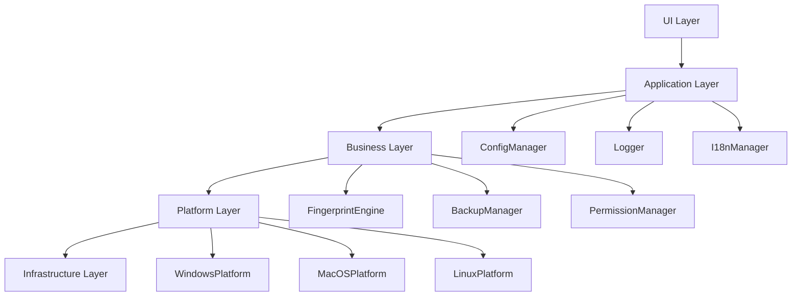

# CAJanus 架构设计文档

> 📐 **系统架构和设计原理** - 深入理解CAJanus的技术架构

本文档详细描述了CAJanus项目的系统架构、设计原理和技术实现。

## 📋 目录

1. [架构概览](#架构概览)
2. [核心设计原则](#核心设计原则)
3. [系统架构](#系统架构)
4. [模块设计](#模块设计)
5. [数据流设计](#数据流设计)
6. [安全架构](#安全架构)
7. [性能设计](#性能设计)
8. [扩展性设计](#扩展性设计)

---

## 架构概览

### 系统定位
CAJanus是一个专为教育和研究设计的跨平台设备指纹识别与修改工具，采用模块化架构，支持Windows、macOS和Linux三大操作系统。

### 技术栈
```
┌─────────────────────────────────────────┐
│           应用层 (Application)           │
│  Python 3.8+ | PyQt5 | 教育工具        │
├─────────────────────────────────────────┤
│           框架层 (Framework)            │
│  配置管理 | 日志系统 | 国际化 | 测试     │
├─────────────────────────────────────────┤
│           平台层 (Platform)             │
│  Windows API | macOS API | Linux API   │
├─────────────────────────────────────────┤
│           系统层 (System)               │
│  操作系统 | 硬件驱动 | 网络栈          │
└─────────────────────────────────────────┘
```

### 核心特性
- **跨平台支持**：统一的API抽象，支持多操作系统
- **模块化设计**：高内聚、低耦合的模块结构
- **安全优先**：多重确认机制和完整备份保护
- **教育导向**：专为教学和研究设计的功能

---

## 核心设计原则

### 1. 单一职责原则 (SRP)
每个模块和类都有明确的单一职责：
- `ConfigManager`：专门负责配置管理
- `FingerprintEngine`：专门负责设备指纹识别
- `BackupManager`：专门负责备份和恢复

### 2. 开闭原则 (OCP)
系统对扩展开放，对修改关闭：
- 通过接口定义行为规范
- 通过工厂模式支持新平台扩展
- 通过插件机制支持功能扩展

### 3. 依赖倒置原则 (DIP)
高层模块不依赖低层模块，都依赖抽象：
```python
# 抽象接口
class IFingerprintEngine(ABC):
    @abstractmethod
    def get_network_adapters(self) -> List[NetworkAdapter]:
        pass

# 具体实现
class WindowsFingerprintEngine(IFingerprintEngine):
    def get_network_adapters(self) -> List[NetworkAdapter]:
        # Windows特定实现
        pass
```

### 4. 接口隔离原则 (ISP)
客户端不应该依赖它不需要的接口：
- 将大接口拆分为多个小接口
- 每个接口专注于特定功能领域

---

## 系统架构

### 分层架构
```
┌─────────────────────────────────────────────────────────┐
│                    表现层 (Presentation)                 │
│  MainWindow | Dialogs | Widgets | Styles               │
├─────────────────────────────────────────────────────────┤
│                    应用层 (Application)                  │
│  Controllers | Services | Validators                   │
├─────────────────────────────────────────────────────────┤
│                    业务层 (Business)                     │
│  FingerprintEngine | BackupManager | PermissionManager │
├─────────────────────────────────────────────────────────┤
│                    平台层 (Platform)                     │
│  WindowsPlatform | MacOSPlatform | LinuxPlatform       │
├─────────────────────────────────────────────────────────┤
│                    基础层 (Infrastructure)               │
│  ConfigManager | Logger | I18nManager | DataModels     │
└─────────────────────────────────────────────────────────┘
```

### 模块依赖关系


---

## 模块设计

### 核心模块架构

#### 配置管理模块
```python
class ConfigManager:
    """配置管理器 - 统一的配置管理接口"""
    
    def __init__(self, config_file: str):
        self.config_file = Path(config_file)
        self.config: Dict[str, Any] = {}
        self._watchers: List[ConfigWatcher] = []
    
    def get_config(self, key: str, default: Any = None) -> Any:
        """获取配置值，支持点号分隔的嵌套键"""
        return self._get_nested_value(self.config, key, default)
    
    def set_config(self, key: str, value: Any):
        """设置配置值并通知观察者"""
        self._set_nested_value(self.config, key, value)
        self._notify_watchers(key, value)
    
    def watch_config(self, key: str, callback: Callable):
        """监听配置变更"""
        self._watchers.append(ConfigWatcher(key, callback))
```

#### 平台工厂模块
```python
class PlatformFactory:
    """平台工厂 - 创建平台特定的实现"""
    
    _instance = None
    _engines: Dict[PlatformType, Type[IFingerprintEngine]] = {}
    
    def __new__(cls):
        if cls._instance is None:
            cls._instance = super().__new__(cls)
        return cls._instance
    
    @classmethod
    def register_engine(cls, platform: PlatformType, engine_class: Type[IFingerprintEngine]):
        """注册平台引擎"""
        cls._engines[platform] = engine_class
    
    def get_fingerprint_engine(self) -> IFingerprintEngine:
        """获取当前平台的指纹识别引擎"""
        platform = self.get_current_platform()
        engine_class = self._engines.get(platform)
        
        if engine_class is None:
            raise UnsupportedPlatformError(f"不支持的平台: {platform}")
        
        return engine_class()
```

#### 安全确认模块
```python
class ConfirmationSystem:
    """三级确认系统"""
    
    def __init__(self):
        self.confirmation_levels = [
            BasicConfirmation(),
            RiskConfirmation(),
            FinalConfirmation()
        ]
    
    async def confirm_operation(self, operation: Operation) -> bool:
        """执行三级确认流程"""
        for level, confirmation in enumerate(self.confirmation_levels, 1):
            result = await confirmation.confirm(operation)
            
            if not result.confirmed:
                self.logger.info(f"用户在第{level}级确认中取消操作")
                return False
            
            if result.requires_additional_info:
                operation.additional_info.update(result.additional_info)
        
        return True
```

### 数据模型设计

#### 网络适配器模型
```python
@dataclass
class NetworkAdapter:
    """网络适配器数据模型"""
    id: str
    name: str
    description: str
    mac_address: str
    ip_addresses: List[str]
    status: AdapterStatus
    adapter_type: AdapterType
    is_physical: bool
    properties: Dict[str, Any] = field(default_factory=dict)
    
    def __post_init__(self):
        """数据验证和处理"""
        self.mac_address = self._normalize_mac_address(self.mac_address)
        self._validate_data()
    
    def _normalize_mac_address(self, mac: str) -> str:
        """标准化MAC地址格式"""
        # 移除分隔符并转换为大写
        clean_mac = re.sub(r'[:-]', '', mac).upper()
        # 添加冒号分隔符
        return ':'.join(clean_mac[i:i+2] for i in range(0, 12, 2))
    
    def to_dict(self) -> Dict[str, Any]:
        """转换为字典格式"""
        return asdict(self)
    
    @classmethod
    def from_dict(cls, data: Dict[str, Any]) -> 'NetworkAdapter':
        """从字典创建实例"""
        return cls(**data)
```

---

## 数据流设计

### 数据流向图
```
用户操作 → UI控件 → 控制器 → 业务服务 → 平台引擎 → 系统API
    ↓         ↓        ↓        ↓         ↓         ↓
状态更新 ← UI更新 ← 结果处理 ← 数据转换 ← 平台适配 ← 系统响应
```

### 典型操作流程

#### MAC地址修改流程
```python
async def modify_mac_address_flow(adapter_id: str, new_mac: str):
    """MAC地址修改完整流程"""
    
    # 1. 数据验证
    validator = MacAddressValidator()
    if not validator.validate(new_mac):
        raise ValidationError("MAC地址格式无效")
    
    # 2. 权限检查
    permission_manager = get_permission_manager()
    if not permission_manager.check_admin_privileges():
        raise PermissionError("需要管理员权限")
    
    # 3. 创建备份
    backup_manager = get_backup_manager()
    backup_result = await backup_manager.create_backup(
        BackupType.NETWORK_CONFIG,
        f"修改MAC地址前备份_{datetime.now().strftime('%Y%m%d_%H%M%S')}"
    )
    
    if not backup_result.success:
        raise BackupError("备份创建失败")
    
    # 4. 三级确认
    operation = ModifyMacOperation(adapter_id, new_mac)
    confirmation_system = ConfirmationSystem()
    
    if not await confirmation_system.confirm_operation(operation):
        return OperationResult(success=False, message="用户取消操作")
    
    # 5. 执行修改
    fingerprint_engine = get_fingerprint_engine()
    modify_result = await fingerprint_engine.modify_mac_address(adapter_id, new_mac)
    
    # 6. 验证结果
    if modify_result.success:
        # 验证修改是否生效
        updated_adapter = fingerprint_engine.get_network_adapter(adapter_id)
        if updated_adapter.mac_address.upper() == new_mac.upper():
            return OperationResult(success=True, message="MAC地址修改成功")
        else:
            return OperationResult(success=False, message="修改未生效，请检查系统状态")
    else:
        return OperationResult(success=False, message=modify_result.error_message)
```

---

## 安全架构

### 安全设计原则

#### 1. 纵深防御
```
用户界面 → 输入验证 → 权限检查 → 三级确认 → 备份保护 → 操作执行
    ↓         ↓         ↓         ↓         ↓         ↓
安全提示   数据校验   权限验证   风险评估   数据保护   操作审计
```

#### 2. 最小权限原则
- 仅在必要时请求管理员权限
- 权限检查贯穿整个操作流程
- 操作完成后及时释放权限

#### 3. 完整性保护
```python
class IntegrityManager:
    """完整性管理器"""
    
    def __init__(self):
        self.hash_algorithm = hashlib.sha256
    
    def calculate_checksum(self, data: bytes) -> str:
        """计算数据校验和"""
        return self.hash_algorithm(data).hexdigest()
    
    def verify_backup_integrity(self, backup_file: Path) -> bool:
        """验证备份文件完整性"""
        try:
            with open(backup_file, 'rb') as f:
                data = f.read()
            
            # 从文件名或元数据中获取预期校验和
            expected_checksum = self._get_expected_checksum(backup_file)
            actual_checksum = self.calculate_checksum(data)
            
            return expected_checksum == actual_checksum
        except Exception as e:
            self.logger.error(f"完整性验证失败: {e}")
            return False
```

### 审计日志设计
```python
class AuditLogger:
    """审计日志记录器"""
    
    def __init__(self):
        self.audit_log = get_logger("audit")
    
    def log_operation(self, operation: Operation, result: OperationResult):
        """记录操作审计日志"""
        audit_entry = {
            "timestamp": datetime.now().isoformat(),
            "user": self._get_current_user(),
            "operation": operation.type,
            "target": operation.target,
            "parameters": operation.parameters,
            "result": result.success,
            "message": result.message,
            "risk_level": operation.risk_level,
            "confirmation_levels": operation.confirmation_levels
        }
        
        self.audit_log.info(json.dumps(audit_entry, ensure_ascii=False))
```

---

## 性能设计

### 性能优化策略

#### 1. 缓存机制
```python
class CacheManager:
    """缓存管理器"""
    
    def __init__(self, max_size: int = 1000, ttl: int = 300):
        self.cache: Dict[str, CacheEntry] = {}
        self.max_size = max_size
        self.ttl = ttl  # 生存时间（秒）
    
    def get(self, key: str) -> Optional[Any]:
        """获取缓存值"""
        entry = self.cache.get(key)
        
        if entry is None:
            return None
        
        if time.time() - entry.timestamp > self.ttl:
            del self.cache[key]
            return None
        
        entry.access_count += 1
        entry.last_access = time.time()
        return entry.value
    
    def set(self, key: str, value: Any):
        """设置缓存值"""
        if len(self.cache) >= self.max_size:
            self._evict_lru()
        
        self.cache[key] = CacheEntry(
            value=value,
            timestamp=time.time(),
            access_count=1,
            last_access=time.time()
        )
```

#### 2. 异步处理
```python
class AsyncOperationManager:
    """异步操作管理器"""
    
    def __init__(self, max_workers: int = 4):
        self.executor = ThreadPoolExecutor(max_workers=max_workers)
        self.running_operations: Dict[str, Future] = {}
    
    async def execute_async(self, operation: Operation) -> OperationResult:
        """异步执行操作"""
        operation_id = str(uuid.uuid4())
        
        # 提交到线程池执行
        future = self.executor.submit(self._execute_operation, operation)
        self.running_operations[operation_id] = future
        
        try:
            # 等待操作完成
            result = await asyncio.wrap_future(future)
            return result
        finally:
            # 清理完成的操作
            self.running_operations.pop(operation_id, None)
```

#### 3. 内存管理
```python
class MemoryManager:
    """内存管理器"""
    
    def __init__(self, max_memory_mb: int = 512):
        self.max_memory_bytes = max_memory_mb * 1024 * 1024
        self.memory_monitor = MemoryMonitor()
    
    def check_memory_usage(self):
        """检查内存使用情况"""
        current_usage = self.memory_monitor.get_current_usage()
        
        if current_usage > self.max_memory_bytes:
            self._trigger_garbage_collection()
            self._clear_caches()
    
    def _trigger_garbage_collection(self):
        """触发垃圾回收"""
        import gc
        collected = gc.collect()
        self.logger.debug(f"垃圾回收释放了 {collected} 个对象")
```

---

## 扩展性设计

### 插件架构
```python
class PluginManager:
    """插件管理器"""
    
    def __init__(self):
        self.plugins: Dict[str, Plugin] = {}
        self.plugin_hooks: Dict[str, List[Callable]] = {}
    
    def register_plugin(self, plugin: Plugin):
        """注册插件"""
        self.plugins[plugin.name] = plugin
        
        # 注册插件的钩子函数
        for hook_name, hook_func in plugin.get_hooks().items():
            if hook_name not in self.plugin_hooks:
                self.plugin_hooks[hook_name] = []
            self.plugin_hooks[hook_name].append(hook_func)
    
    def execute_hook(self, hook_name: str, *args, **kwargs):
        """执行钩子函数"""
        hooks = self.plugin_hooks.get(hook_name, [])
        results = []
        
        for hook in hooks:
            try:
                result = hook(*args, **kwargs)
                results.append(result)
            except Exception as e:
                self.logger.error(f"插件钩子执行失败: {e}")
        
        return results
```

### 平台扩展机制
```python
# 新平台支持只需实现接口
class NewPlatformFingerprintEngine(IFingerprintEngine):
    """新平台指纹识别引擎"""
    
    def get_network_adapters(self) -> List[NetworkAdapter]:
        """实现新平台的网络适配器获取逻辑"""
        pass
    
    def modify_mac_address(self, adapter_id: str, new_mac: str) -> bool:
        """实现新平台的MAC地址修改逻辑"""
        pass

# 注册新平台
PlatformFactory.register_engine(
    PlatformType.NEW_PLATFORM,
    NewPlatformFingerprintEngine
)
```

### 功能扩展接口
```python
class FeatureExtension(ABC):
    """功能扩展基类"""
    
    @abstractmethod
    def get_name(self) -> str:
        """获取扩展名称"""
        pass
    
    @abstractmethod
    def get_description(self) -> str:
        """获取扩展描述"""
        pass
    
    @abstractmethod
    def initialize(self, context: ExtensionContext):
        """初始化扩展"""
        pass
    
    @abstractmethod
    def execute(self, parameters: Dict[str, Any]) -> ExtensionResult:
        """执行扩展功能"""
        pass
```

---

## 📚 相关文档

- [开发指南](development-guide.md) - 开发环境和流程
- [API参考](api-reference.md) - 接口文档和示例
- [部署指南](../deployment/deployment-guide.md) - 生产环境部署

---

**最后更新**：2024年1月15日  
**文档版本**：v1.0.0
